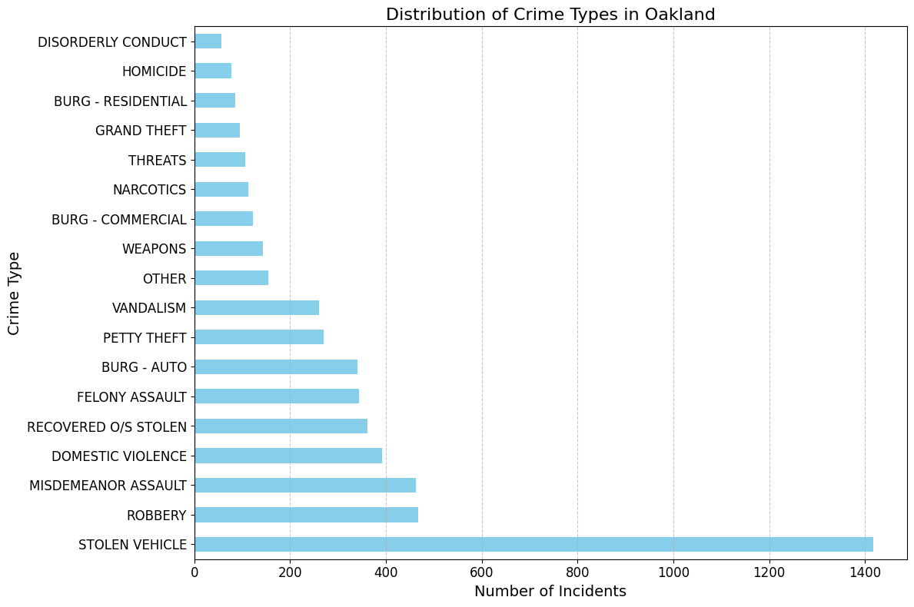

# Project Title

## Dataset
[CrimeWatch Maps Past 90-Days] (https://data.oaklandca.gov/Public-Safety/CrimeWatch-Maps-Past-90-Days/ym6k-rx7a/about_data)

## Why did I choose this dataset?

*I chose this dataset because I am interested in current police actiivity in my community and am upset with how secrative our police department is and how limited the publics access to this information is.*

## Progress
- [x] Picked dataset
- [x] Wrote explaination
- [x] Defined questions
- [ ] Answered questions using Pandas
- [ ] Added data visualizations (using Matplotlib and/or Seaborn)
- [ ] Prepared presentation slides

## Questions
- [x] Question 1: *What is the most common type of crime in Oakland?*
  - Answer: [Vehicle Theft by far, followed by Burgalry and Misdemeanor Assault]
  - Visualization: 

- [ ] Question 2: *How does the frequency of different crime types vary by neighborhood?*
  - Answer: [Placeholder for answer]
  - Visualization: ![Q2 Visualization]

- [ ] Question 3: *Are there any noticeable trends in crime over time ?*
  - Answer: [Placeholder for answer]
  - Visualization: ![Q3 Visualization]

- [ ] Question 4: *Is there a correlation between the time of day and the type of crime committed?*
  - Answer: [Placeholder for answer]
  - Visualization: ![Q4 Visualization]

- [ ] Question 5: *Where are the hotspots for specific types of crimes in Oakland?*
  - Answer: [Placeholder for answer]
  - Visualization: ![Q5 Visualization]

- [ ] Question 6: *Are there any patterns in repeat offenses at the same address?*
  - Answer: [Placeholder for answer]
  - Visualization: ![Q6 Visualization]

- [ ] Question 7: *What proportion of crimes involve property versus violent crimes?*
  - Answer: [Placeholder for answer]
  - Visualization: ![Q7 Visualization]

- [ ] Question 8: *How has the rate of vehicle theft changed over time?*
  - Answer: [Placeholder for answer]
  - Visualization: ![Q8 Visualization]
