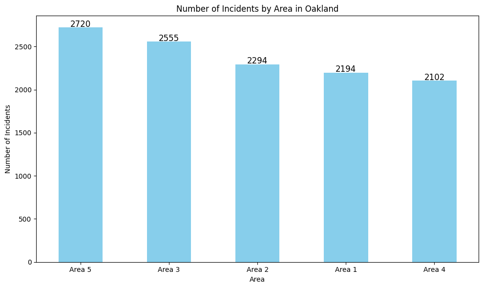

# 90 Day Oakland Police Dept. Study

## Dataset
CrimeWatch Maps Past 90-Days - (https://data.oaklandca.gov/Public-Safety/CrimeWatch-Maps-Past-90-Days/ym6k-rx7a/about_data)

## Why did I choose this dataset?

*I chose this dataset because I am interested in current police actiivity in my community and am upset with how secrative our police department is and how limited the publics access to this information is.*

## Progress
- [x] Picked dataset
- [x] Wrote explaination
- [x] Defined questions
- [ ] Answered questions using Pandas
- [ ] Added data visualizations (using Matplotlib and/or Seaborn)
- [ ] nb Prepared presentation slides

## Questions
- [x] Question 1: *What is the most common type of crime in Oakland?*
  - Answer: Vehicle Theft by far, followed by Burgalry and Misdemeanor Assault.
  - Visualization: 

- [x] Question 2: *How does the frequency of different crime types vary by neighborhood?*
  - Answer: The most incidents occured near International Blvd. followed by 2 districs in Downtown Oakland.
  - Visualization: 

  - [ ] Question 3: *What areas have the highest crime rate?*
    - Answer: Area 5, or Deep East Oakland around the coleseum and 55th street are experiencing the highest crime rates as of the last 90 days.
    - Visualization: 